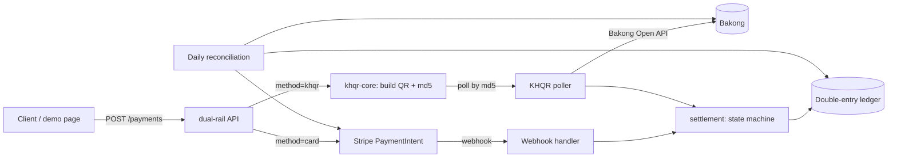
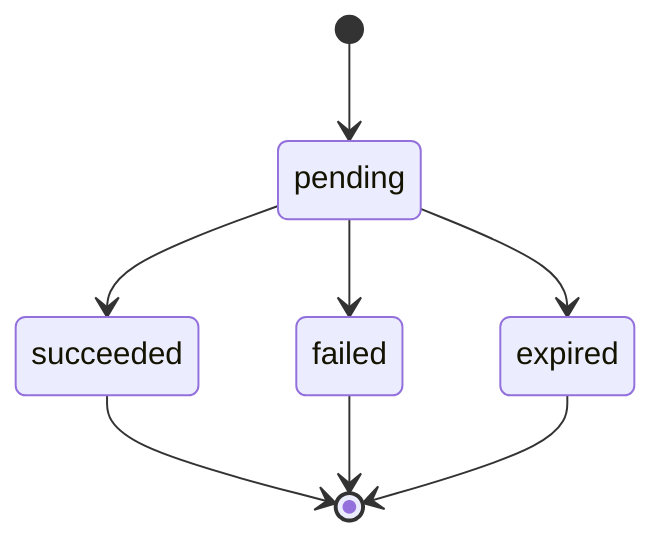

# dual-rail

A Rust payment service that takes **international cards through Stripe** and **Cambodian bank-app payments through Bakong KHQR** behind one API, one status model and one double-entry ledger, checked every day by a reconciliation job.

Cambodian merchants selling to both tourists and locals need both rails. KHQR libraries exist, and so do multi-processor orchestrators, but nothing puts card and KHQR payments under one ledger with the guarantees that make payments hard: idempotent creates, reliable webhooks, a ledger that always balances, and a daily reconciliation. That's what this project does, for two rails.

## Architecture





Only `pending` can change, and terminal states are final. Every status change and its ledger entry are written in **one database transaction**, through a single guarded update (`... WHERE status = 'pending'`). A successful payment debits the provider's clearing account (`clearing:stripe` or `clearing:bakong`) and credits `revenue`. Ledger rows are append-only, enforced by database triggers.

| Crate | Role |
|---|---|
| `crates/core` | `Money` (integer minor units, checked arithmetic), status transitions, balanced journal entries, reconciliation rules. No IO. |
| `crates/rails` | Stripe gateway, our own Stripe webhook signature check, KHQR issuing and the Bakong verifier |
| `crates/store` | sqlx repositories (compile-checked queries); migrations live in `migrations/` |
| `crates/api` | axum handlers, settlement, the KHQR poller, reconciliation, and the demo page (`web/demo.html`) |

## Failure modes handled

| Failure | What happens |
|---|---|
| **Duplicate webhooks** | Each Stripe event id is recorded in `processed_events` inside the settling transaction. Replays, even concurrent ones, credit exactly once. |
| **Out-of-order events** | The guarded update ignores anything that arrives after a payment is final (e.g. `canceled` after `succeeded`). `payment_intent.payment_failed` leaves the payment `pending`, because Stripe lets the customer retry the same intent. |
| **Forged or replayed webhooks** | The HMAC-SHA256 is checked over the raw body before parsing, with a 300s tolerance. Every `v1` signature is tried, so rotating the webhook secret doesn't drop events. |
| **Crash between steps** | The status change, the ledger entry and the event record commit together or not at all. A card payment's row exists before its Stripe intent, and Stripe's idempotency key is derived from our payment id, so a retry can never create a second charge. |
| **Client retries** | `Idempotency-Key`: the same key and body replay the original payment (and finish a Stripe link a crash interrupted); a different body gets `409`. Concurrent identical requests create one row. |
| **Late KHQR payment** | A payment is expired only after Bakong confirms "not paid" *after* the expiry plus a 2-minute grace, so a last-second payment still being indexed isn't lost. A transfer made after expiry is never auto-credited: it's flagged for review. |
| **Bakong outage / geo restriction** | Bakong's production API only answers Cambodian IPs. Verification goes through a trait (direct, or a relay via `BAKONG_BASE_URL`). Production Bakong refuses the md5 *batch* endpoint with a 403, so the verifier falls back to single lookups. An outage never expires a payment; after 24h of failures it's flagged `unverifiable`. |
| **Wrong amount** | A provider amount, currency or receiving account that doesn't match ours is never credited; it goes to `review_flags`. KHQR amounts go into the QR through `khqr-core`'s exact integer API (`amount_minor`), never through a float. |
| **Duplicate KHQR** | Each QR carries the payment id (base36) as its bill number, so identical orders never share an md5, and one Bakong transfer can credit at most one payment. |
| **Lost webhook / drift** | The daily reconciliation compares the ledger with Stripe and Bakong and reports `missing_in_ledger`, `missing_at_provider`, `amount_mismatch`, `paid_after_expiry`, `stale_pending` and ledger-integrity problems. It never auto-fixes. |

## Quickstart

Requirements: Docker with Compose, and the [Stripe CLI](https://docs.stripe.com/stripe-cli) for card webhooks.

```sh
cp .env.example .env                  # fill in the values below
docker compose up --build             # app on http://localhost:8080, Postgres on :5432
stripe listen --forward-to localhost:8080/webhooks/stripe
```

`stripe listen` prints a `whsec_...` secret. Put it in `.env` as `STRIPE_WEBHOOK_SECRET` and restart the app. Then open <http://localhost:8080>, choose Card, and pay with `4242 4242 4242 4242`.

KHQR needs a Bakong Open API token (`BAKONG_TOKEN`, sandbox by default) and a server in Cambodia or a relay. Without them the demo still issues a scannable QR, and the poller logs Bakong's refusal and keeps the payment `pending`.

## Configuration

| Variable | Required | Default | Meaning |
|---|---|---|---|
| `DATABASE_URL` | yes | | Postgres connection string |
| `BIND_ADDR` | | `0.0.0.0:8080` | HTTP listen address |
| `STRIPE_SECRET_KEY` | yes | | Stripe secret key (`sk_test_...`) |
| `STRIPE_WEBHOOK_SECRET` | yes | | Webhook signing secret (`whsec_...`) |
| `STRIPE_PUBLISHABLE_KEY` | | | Enables cards on the demo page |
| `KHQR_ACCOUNT_ID` | yes | | Bakong account receiving payments, e.g. `name@bank` |
| `KHQR_MERCHANT_NAME`, `KHQR_MERCHANT_CITY` | yes | | Shown in the customer's bank app |
| `KHQR_MERCHANT_ID`, `KHQR_ACQUIRING_BANK` | | | Set both to issue merchant (not individual) QRs |
| `KHQR_TTL_SECS` | | `300` | QR lifetime (60–86400) |
| `BAKONG_TOKEN` | yes | | Bakong Open API token |
| `BAKONG_ENV` | one of | | `sandbox` or `production` |
| `BAKONG_BASE_URL` | these | | Relay base URL instead of calling Bakong directly |
| `BAKONG_RENEWAL_EMAIL` | | | Lets the client renew an expired token |
| `BAKONG_POLL_INTERVAL_SECS` | | `2` | At most one batched Bakong call per interval |
| `RECONCILIATION_UTC_OFFSET` | | `+07:00` | Business-day time zone for reconciliation |

## API

| Method | Path | Purpose |
|---|---|---|
| `POST` | `/payments` | Create a payment. Requires `Idempotency-Key`. |
| `GET` | `/payments/{id}` | Current status (the demo polls this) |
| `GET` | `/payments/{id}/qr.svg` | The KHQR as an image |
| `POST` | `/webhooks/stripe` | Stripe webhook receiver |
| `GET` | `/health` | Liveness plus database check |
| `GET` | `/` | Demo checkout page |

```http
POST /payments
Idempotency-Key: 7f3c9b2e-...
Content-Type: application/json

{ "method": "khqr", "amount_minor": 1000, "currency": "USD", "description": "Order #1" }
```

`amount_minor` is in ISO 4217 minor units for every currency: `1000` is USD 10.00, and 1000 riel is `100000`. KHQR accepts whole riel only. The `201` response carries `client_secret` for cards, or `qr`, `md5` and `expires_at` for KHQR. A replay adds the header `Idempotent-Replayed: true`.

## Reconciliation

It runs automatically each day after 01:00 local time for the previous day, and records results in `reconciliation_runs` (`completed`, `incomplete` when a provider couldn't be reached, or `failed`). To run a day by hand:

```sh
docker compose run --rm app dual-rail-api reconcile 2026-09-26
```

## Development

```sh
docker compose up -d postgres
cargo test --workspace                       # needs DATABASE_URL (see .env.example)
cargo fmt --all -- --check
SQLX_OFFLINE=true cargo clippy --workspace --all-targets -- -D warnings
cargo sqlx prepare --workspace               # after changing a query or migration; commit .sqlx/
```

Integration tests run against a real Postgres (`sqlx::test` creates a database per test) with in-memory Stripe and Bakong fakes. They include webhook chaos tests: 5× replays, concurrent deliveries, late events, and forged signatures.

## Known limitations

- **KHQR paid twice:** a dynamic KHQR can be paid more than once, and Bakong's md5 lookup doesn't expose the second transfer. Catching it needs the merchant's bank statement, so each reconciliation run records `double_payment_check: "not_available"`.
- **Bakong rate limits:** the free Open API's limits aren't clearly documented. Confirm them with NBC before relying on polling in production.
- **Not in v1:** refunds, partial captures, FX, merchant dashboard, multi-tenancy, authentication on the API, and routing across processors.

## License

MIT. See [LICENSE](LICENSE).
