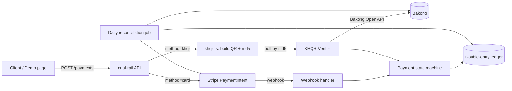
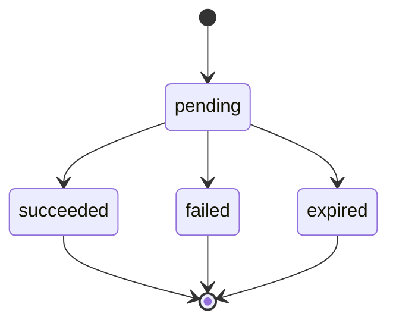

# dual-rail — Stripe + KHQR Unified Checkout with Ledger

> Implementation brief for coding agents. Read fully before writing code.

## 1. What we're building

A Rust service that accepts payments through **two rails**:

- **Stripe** for international cards
- **Bakong KHQR** for Cambodian bank/e-wallet QR payments

Both rails are exposed through **one API and one status model**. Every successful payment is recorded in a **double-entry ledger** and checked daily by a **reconciliation job**.

## 2. Why this project

| Reason | Detail |
|---|---|
| Unique | KHQR libraries exist (Python, Go, Java, Node.js) and generic orchestrators exist (Hyperswitch), but none combine card and KHQR payments under one ledger. |
| Shows real fintech skills | The hard parts of payments are idempotency, webhook reliability, ledger correctness and reconciliation, not calling an API. This project demonstrates all four. |
| Reuses our work | Depends on our `khqr-rs` crate for KHQR encoding/decoding. |

**Not a goal:** competing with Hyperswitch (routing across 100+ processors). Stay focused on two rails done correctly.

## 3. Tech stack

| Layer | Choice | Notes |
|---|---|---|
| Language | Rust (stable, edition 2024) | |
| HTTP | `axum` | |
| DB | Postgres + `sqlx` | Use compile-checked queries and `sqlx migrate`. |
| Stripe | `async-stripe` 1.0 RC line | **Pin the exact version** in Cargo.toml; the 1.0 API is still a release candidate and may change. Enable only the needed sub-crates (core, payment intents, webhooks). |
| KHQR | `khqr-rs` (ours) | Generate QR string + MD5 used for payment lookup. |
| Async jobs | `tokio` tasks | Poller + reconciliation. No external queue in v1. |
| Config | env vars via `dotenvy` + typed config struct | |
| Observability | `tracing` + `tracing-subscriber` (JSON logs) | |
| Packaging | Dockerfile + `docker-compose.yml` (app + postgres) | |
| CI | GitHub Actions: fmt, clippy `-D warnings`, test, sqlx offline check | |

## 4. High-level flow



### 4.1 Card payment (Stripe)

1. Client calls `POST /payments` with `method: "card"`, amount and currency, plus an `Idempotency-Key` header.
2. The service creates a `payments` row (`pending`) and a Stripe PaymentIntent, forwarding the idempotency key to Stripe.
3. The response returns `client_secret`; the client confirms with Stripe.js.
4. Stripe sends `payment_intent.succeeded` / `payment_intent.payment_failed` to `POST /webhooks/stripe`.
5. The webhook handler verifies the signature, dedupes by `event.id`, and transitions the payment.
6. On `succeeded`, write ledger entries in the **same DB transaction** as the status change.

### 4.2 KHQR payment

1. Client calls `POST /payments` with `method: "khqr"` and an `Idempotency-Key` header.
2. The service builds a dynamic KHQR string using `khqr-rs` and stores the QR string, its `md5`, and `expires_at` (default: 5 min).
3. The response returns the QR string (and optionally a PNG data URL) for display.
4. A background **verifier** polls Bakong's check-transaction endpoint by `md5` with backoff until paid or expired.
5. When paid, transition to `succeeded` and write ledger entries. If the deadline passes, transition to `expired`.

## 5. Payment state machine



Rules:
- Only `pending` can transition. Terminal states never change (v1 has no refunds).
- Enforce this in the DB with a guarded update such as `UPDATE ... SET status=$new WHERE id=$id AND status='pending'`. If 0 rows are affected, treat it as a duplicate or late event: log it and do nothing.
- Model the states as a Rust `enum PaymentStatus` so invalid transitions don't compile.

## 6. Data model (v1)

```sql
payments (
  id               uuid pk,
  method           text check (method in ('card','khqr')),
  status           text check (status in ('pending','succeeded','failed','expired')),
  amount_minor     bigint not null check (amount_minor > 0),
  currency         text not null,          -- 'USD' | 'KHR'
  idempotency_key  text not null unique,
  provider_ref     text,                   -- Stripe PI id, or KHQR md5
  khqr_payload     text,                   -- KHQR string (khqr only)
  expires_at       timestamptz,            -- khqr only
  created_at, updated_at timestamptz
)

processed_events (                          -- webhook/poll dedupe
  provider   text,                          -- 'stripe' | 'bakong'
  event_id   text,
  processed_at timestamptz,
  primary key (provider, event_id)
)

ledger_accounts (id, code unique, name)    -- e.g. clearing:stripe, clearing:bakong, revenue

journal_entries (id uuid pk, payment_id uuid fk, created_at)

ledger_lines (
  id uuid pk,
  journal_entry_id uuid fk,
  account_id fk,
  direction text check (direction in ('debit','credit')),
  amount_minor bigint check (amount_minor > 0),
  currency text
)

reconciliation_runs (id, run_date, status, mismatches jsonb, created_at)
```

## 7. Ledger rules

On `succeeded`, write one journal entry:

| Rail | Debit | Credit |
|---|---|---|
| card | `clearing:stripe` | `revenue` |
| khqr | `clearing:bakong` | `revenue` |

Invariants (enforce in code **and** cover with tests):
- For every journal entry, the sum of debits equals the sum of credits, per currency.
- Ledger rows are **append-only**: never update or delete them. Corrections are new entries.
- The status change and the ledger write happen in **one transaction**.

Stripe fees are v2: they come from the Stripe balance transaction and would debit `fees:stripe`.

## 8. API (v1)

| Method | Path | Purpose |
|---|---|---|
| POST | `/payments` | Create a payment. Requires the `Idempotency-Key` header. |
| GET | `/payments/{id}` | Get status (the demo page polls this). |
| POST | `/webhooks/stripe` | Stripe webhook receiver. |
| GET | `/health` | Liveness + DB check. |
| GET | `/` | Demo checkout page (static HTML). |

Request example:

```json
POST /payments
Idempotency-Key: 7f3c...
{ "method": "khqr", "amount_minor": 1000, "currency": "USD", "description": "Demo order #1" }
```

Idempotency: if the same key comes back with the same body, return the original response. If the key comes back with a different body, return `409`.

## 9. Critical gotchas (read these)

1. **Money is integers.** Use `i64` minor units only; never floats. Wrap amounts in a `Money { amount_minor, currency }` newtype.
2. **Stripe webhook signatures.** Verify against the **raw body bytes** before any JSON parsing. In axum, extract the body as `Bytes`, not `Json`.
3. **Webhooks are at-least-once and unordered.** Dedupe on `event.id` via `processed_events` and rely on the guarded state transitions (§5).
4. **Bakong geo restriction.** In production, Bakong's check-transaction endpoint only accepts calls from servers located in **Cambodia**. Put verification behind a trait:
   ```rust
   #[async_trait]
   trait KhqrVerifier { async fn check(&self, md5: &str) -> Result<KhqrStatus>; }
   ```
   Implementations: `BakongDirect` (server in Cambodia), `Relay` (proxy), `Mock` (tests/demo). Use the Bakong **SIT sandbox** for the public demo.
5. **Secrets.** Never commit the Stripe secret key, webhook secret or Bakong token. Provide a `.env.example` only.
6. **KHQR expiry.** An expired QR must never flip to `succeeded` through our poller. If Bakong later reports a payment for an expired QR, flag it for manual review in reconciliation. Do not auto-credit it.
7. **Poll politely.** Use exponential backoff (e.g. 2s → 5s → 10s, capped) and stop at `expires_at`, to respect Bakong rate limits.

## 10. Reconciliation job (daily)

For the previous day:
1. Load our `succeeded` payments per rail.
2. Fetch the provider's view: Stripe PaymentIntents/charges for the date range, and Bakong transaction lookups by md5.
3. Compare by `provider_ref`, amount and currency.
4. Store any mismatches in `reconciliation_runs.mismatches`, e.g. `missing_in_ledger`, `missing_at_provider`, `amount_mismatch`, `paid_after_expiry`.
5. Log a summary. Never auto-fix; only report.

## 11. Suggested repo layout

```
dual-rail/
├─ Cargo.toml                # workspace
├─ crates/
│  ├─ core/                  # Money, PaymentStatus, ledger logic (no IO) — heavily unit-tested
│  ├─ rails/                 # Stripe adapter, KHQR adapter, KhqrVerifier trait + impls
│  ├─ store/                 # sqlx repositories + migrations
│  └─ api/                   # axum app, handlers, jobs (poller, reconciliation), main.rs
├─ migrations/
├─ web/demo.html             # demo checkout page
├─ docker-compose.yml
├─ .env.example
├─ .github/workflows/ci.yml
└─ README.md
```

Keep `core` free of IO so all business rules are testable without a DB or network.

## 12. Milestones

| # | Milestone | Done when |
|---|---|---|
| M1 | Skeleton | Workspace, axum `/health`, Postgres via compose, migrations, CI green |
| M2 | Core domain | `Money`, `PaymentStatus`, ledger balancing, with unit tests |
| M3 | Card rail | Create PI, webhook with signature check + dedupe, ledger write |
| M4 | KHQR rail | QR generation via `khqr-rs`, verifier trait, Mock + SIT impl, poller, expiry |
| M5 | Idempotency | `Idempotency-Key` semantics (replay → same response, different body → 409) |
| M6 | Reconciliation | Daily job + mismatch report |
| M7 | Demo + docs | Demo page, README with architecture diagram and a "failure modes handled" section |

## 13. Testing requirements

- **Unit (core):** ledger always balances; illegal state transitions are rejected; Money arithmetic never overflows silently (use `checked_add`).
- **Integration (store/api):** use `sqlx::test` with a real Postgres.
- **Webhook chaos tests:** replay the same Stripe event 5×, deliver `failed` after `succeeded`, send a bad signature. Result: exactly one ledger entry and correct final status.
- **KHQR:** expiry with the Mock verifier; a payment reported after expiry becomes a reconciliation flag, not a credit.
- **Idempotency:** concurrent identical requests produce one payment row.

## 14. Non-goals for v1

Refunds, partial captures, multi-currency FX, a merchant dashboard, multi-tenant support, and smart routing between processors.

## 15. README must include

- A one-paragraph pitch: why card + KHQR together.
- The architecture and state-machine diagrams (reuse the ones above).
- A **"Failure modes handled"** section: duplicate webhooks, out-of-order events, late KHQR payment, Bakong geo restriction, crash between steps (single transaction).
- Quickstart with `docker compose up` and Stripe CLI (`stripe listen --forward-to localhost:8080/webhooks/stripe`).
